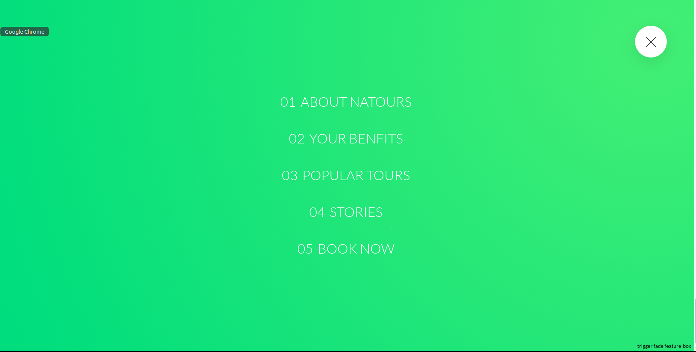

# sass
Learning sass with developmet and production code environment... i used BEM(Block Element Modifier, a css code organisational structure) and 7-in-1 architecture of sass files...

# Demo

---

---
# Follow these steps
1. install nodejs in your desktop (if not installed)
2. npm install
3. npm start (to start the server)
4. npm run build:css (to biuld the production code)
